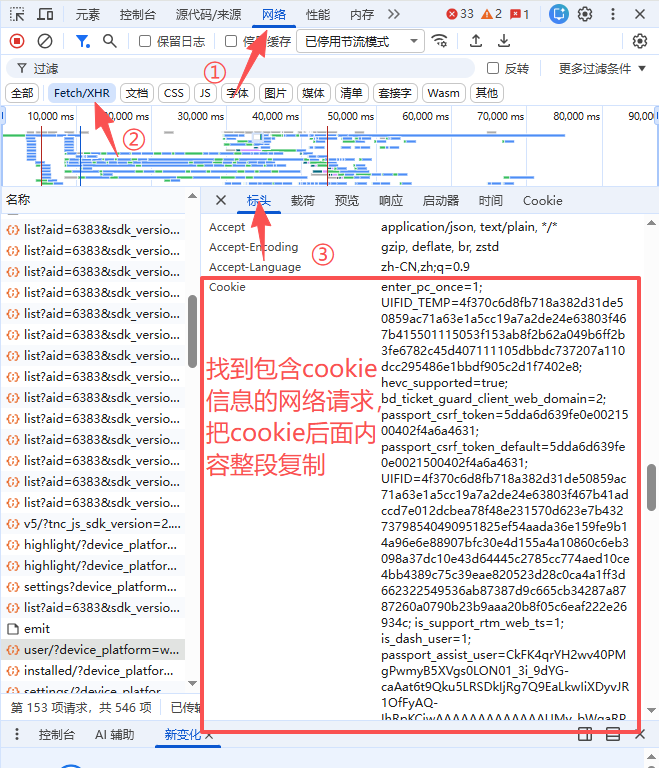

# douyin-dl

个人 / 家庭用的抖音无水印 **视频 / 图文** 下载站：FastAPI + 本地静态页，Docker 一键部署。

仓库：[https://github.com/Achaiccccc/douyin-dl](https://github.com/Achaiccccc/douyin-dl)

> **本项目在 [Evil0ctal/Douyin_TikTok_Download_API](https://github.com/Evil0ctal/Douyin_TikTok_Download_API) 基础上改造而来。**  
> 原项目采用 [Apache License 2.0](https://www.apache.org/licenses/LICENSE-2.0) 开源协议。  
> 本仓库同样以 Apache-2.0 发布，并保留对原作者的署名与许可证声明（见 [`crawlers/NOTICE.md`](crawlers/NOTICE.md)）。

## 为什么要改造

[Evil0ctal/Douyin_TikTok_Download_API](https://github.com/Evil0ctal/Douyin_TikTok_Download_API) 解析能力已经验证可用，但其 Web 首屏会拉取 **jsDelivr 等外网 CDN**、PyWebIO 前端以及 Live2D 等资源。在家庭 NAS + 反向代理场景下，页面打开很慢，还包含 TikTok / B 站、开放 API 文档等个人自用不需要的功能。

因此本项目做了裁剪和重写：

| | 原项目 | 本项目 |
|---|---|---|
| 前端 | PyWebIO + 外网 CDN / Live2D | 本地 HTML / CSS / JS，**零 CDN** |
| 平台 | 抖音 + TikTok + B 站 | **只做抖音** |
| 解析 | 完整 crawler 仓库 | 仅内嵌抖音单条作品解析（`crawlers/` 子集） |
| 访问控制 | 视部署而定 | 访问密码 + session |
| 目标环境 | 通用自建 / 公网 API | 个人 / 家庭 NAS（也可本机或任意 Docker 主机） |

解析签名逻辑（`a_bogus` 等）来自原项目，**没有重新发明反爬**；页面、鉴权、批量解析、图文下载是本项目新增的。

## 功能

- 访问密码登录（session 约 7 天，失败限流）
- 粘贴抖音分享文案 / 链接，一次最多 30 条，流式出结果；失败条目可单独重试
- 视频：最高码率无水印，服务端代理下载（避免手机直链 403 / CORS）
- 图文：解析全部无水印原图，逐张代理下载，也可一键按序下载全部
- 封面 / 图片均走本站代理，不把抖音直链暴露给浏览器
- 文件名：`作者-文案前10字-日期(yy-mm-dd).mp4`（图文带 `-01.webp` 等序号）
- Cookie 从 `data/cookie.txt` 读取，启动时注入内存

## 声明

- 仅供个人学习与家庭使用，请勿做成公开站点或用于商业用途。
- 请遵守抖音用户协议，以及所在地法律法规；下载内容版权归原作者所有。
- 解析依赖你自己提供的登录 Cookie，Cookie 失效需自行更新。

## 快速开始（Docker）

```bash
git clone https://github.com/Achaiccccc/douyin-dl.git
cd douyin-dl
```

1. 把 `data/cookie.txt` 换成你自己的登录 Cookie（仓库里这份是**已过期的格式示例**，不能直接解析）。获取方法见下一节。
2. `docker-compose.yml` 里 `APP_PASSWORD` 默认为 `123456`，方便本地试用。若服务会暴露到公网或 NAS 外网转发，请改成自己的强密码。
3. 启动：

```bash
docker compose up -d --build
```

浏览器打开 `http://127.0.0.1:18080/`（容器内 8080，默认映射到主机 18080）。

健康检查：`GET /healthz` 中 `parser` 应为 `embedded-crawler`，`cookie_length` 应大于 0。

## 如何获取 Cookie

1. 用浏览器登录 [douyin.com](https://www.douyin.com)（需已登录账号）。
2. 按 `F12` 打开开发者工具，切到 **网络**，筛选 **Fetch/XHR**。
3. 刷新页面，点开任意一条请求，在 **标头** 里找到请求头 `Cookie`，把**后面的整段内容**复制到 `data/cookie.txt`（覆盖示例即可，以 `#` 开头的行会被忽略）。
4. 保存后重启容器。

对照下图：



## 本地开发

```bash
python -m venv .venv
# Windows: .venv\Scripts\activate
# Linux / macOS: source .venv/bin/activate
pip install -r requirements.txt

# Windows PowerShell
$env:APP_PASSWORD="123456"
uvicorn app.main:app --host 127.0.0.1 --port 8080

# Linux / macOS
APP_PASSWORD=123456 uvicorn app.main:app --host 127.0.0.1 --port 8080
```

打开 `http://127.0.0.1:8080/`。Cookie 默认读 `./data/cookie.txt`，也可用环境变量 `COOKIE_FILE` 指定。本地开发同样使用 compose 里的示例密码 `123456`，需要时可自行改环境变量。

## 环境变量

| 变量 | 示例 | 说明 |
|------|------|------|
| `APP_PASSWORD` | `123456` | 网页登录密码。仓库默认示例为 `123456`，公网部署请改成强密码 |
| `COOKIE_FILE` | `/data/cookie.txt` | 抖音 Cookie 文件路径 |
| `UPSTREAM_API` | （留空） | 可选。填写后走外部原项目 HTTP 接口，一般不需要 |
| `TZ` | `Asia/Shanghai` | 时区 |

## 绿联 NAS 部署提示

在绿联 DXP 等 NAS 上：把整个目录放到 Docker 项目目录，用自带的 Compose 启动，再对 `18080` 做外网转发即可。Cookie 失效时只改 `data/cookie.txt` 并重启容器。

若构建时拉不到 `python:3.12-slim`，在 Docker 镜像加速器里配置国内镜像，或把 `Dockerfile` 第一行改成带镜像前缀的写法，例如：

```dockerfile
FROM docker.1ms.run/library/python:3.12-slim
```

`Dockerfile` 默认用阿里云 PyPI 安装依赖；在境外构建可覆盖：

```bash
docker build --build-arg PIP_INDEX_URL=https://pypi.org/simple .
```

绿联上「重启容器」不会带上新代码，改代码后需要 **重新构建（rebuild）**。

## 目录结构

```text
douyin-dl/
├── app/                 # FastAPI：登录、解析、封面 / 图片 / 视频代理
├── static/              # 本地静态页（无 CDN）
├── crawlers/            # 来自原项目的抖音 Web 解析子集（Apache-2.0）
├── data/
│   ├── cookie.txt       # 格式示例（已过期，部署时请换成自己的）
│   └── cookie.txt.example
├── cookie-example.png   # 浏览器里复制 Cookie 的步骤截图
├── Dockerfile
├── docker-compose.yml
├── requirements.txt
├── LICENSE              # Apache-2.0
└── README.md
```

## 接口

前端只请求相对路径，需先登录。未提供公开 Swagger。

| 接口 | 说明 |
|------|------|
| `POST /api/login` | 密码登录 |
| `GET /api/me` | 登录状态 |
| `POST /api/parse` | 批量解析（NDJSON 流式返回） |
| `POST /api/parse_one` | 单条重试 |
| `GET /api/cover?id=` | 封面代理 |
| `GET /api/image?id=&i=` | 图文单张代理下载 |
| `GET /api/download?id=` | 视频流式代理下载 |
| `GET /healthz` | 健康检查（不探测抖音） |

解析结果在内存缓存约 10 分钟。

## 致谢与许可

- 抖音 Web 爬虫、`a_bogus` / `x_bogus` 等解析实现来自 [Evil0ctal/Douyin_TikTok_Download_API](https://github.com/Evil0ctal/Douyin_TikTok_Download_API)（[Apache License 2.0](https://www.apache.org/licenses/LICENSE-2.0)）。本仓库 `crawlers/` 为按该许可证嵌入的子集，详见 [`crawlers/NOTICE.md`](crawlers/NOTICE.md)。
- 本项目的前端、鉴权、批量解析、图文下载与 Docker 封装为后续改造内容。

本仓库整体采用 **Apache License 2.0**，详见 [`LICENSE`](LICENSE)。
